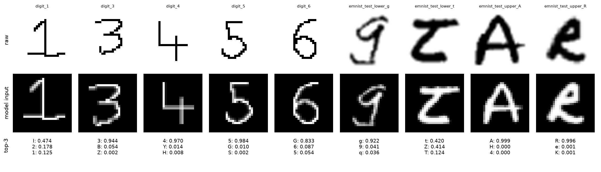

# Handwritten Character Recognition

I built this to read handwritten digits and letters from image files with a small Keras CNN. It started as a tutorial MLP on MNIST. Now it trains reproducibly on MNIST and EMNIST, and a preprocessing step makes images from outside the dataset look like the training data.



This figure shows the EMNIST balanced model (47 classes) on the images in `samples/`. It gets 7 of 9 right. It reads the plain `1` as `I` and the `6` as `G`. The digits-only MNIST model gets all five digits right.

## How it works

- Preprocessing composites transparent PNGs over white and inverts dark-on-light images. It then crops to the ink, scales the longer side to 20 px and centers it by center of mass in a 28x28 frame, the same way MNIST was made.
- EMNIST is read straight from the official NIST archive. Its transposed images are flipped back upright, and each label is mapped to its character.
- The model has two conv blocks (32 and 64 filters) with batch norm and dropout, then a dense layer. Rotation, shift and zoom augmentation runs during training only. The original tutorial MLP is still available with `--arch mlp` as a baseline.
- Training fixes seeds and uses deterministic ops. It holds out 10% of the training set for early stopping and scores the official test set once. Each run saves the model and a JSON file of its metrics to `models/`, and a confusion matrix and training curves to `reports/`.

## Results

I trained every model on CPU (seed 42, up to 15 epochs) and scored each one on its dataset's official test split:

| Dataset | Classes | Original MLP | CNN |
|---|---:|---:|---:|
| MNIST | 10 | 98.09% | 99.39% |
| EMNIST balanced | 47 | 83.84% | 88.46% |
| EMNIST letters | 26 | not trained | 94.16% |

Most errors on EMNIST balanced come from pairs that are ambiguous in handwriting: `O`/`0`, `L`/`1`, `I`/`1` and `F`/`f`. See the [confusion matrix](reports/emnist_balanced_cnn_confusion.png). The repo includes the MNIST and EMNIST balanced models. The other trained models are attached to the [v1.0.0 release](https://github.com/Raaif-Yousuf/AI-Handwritten-Character-Recognition/releases/tag/v1.0.0).

## Run it

```bash
pip install -r requirements.txt
python -m hcr.predict samples/emnist_test_upper_A.png          # EMNIST balanced model
python -m hcr.predict samples/digit_*.png --model models/mnist_cnn.keras
python -m hcr.train --dataset emnist-balanced --arch cnn --epochs 15
```

The first EMNIST training run downloads the dataset (about 536 MB) to `~/.cache/hcr`.

Tests use synthetic data only. Run `pip install -r requirements-dev.txt && pytest` (29 tests); CI runs them on every pull request.

MIT licensed. Based originally on NeuralNine's handwritten digit recognition tutorial.
